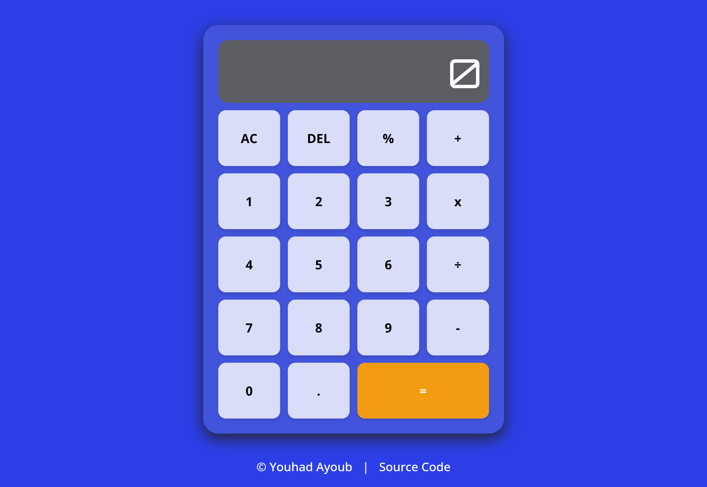

# Calculator Project

A fully functional calculator web application built as part of [The Odin Project Foundations Course](https://www.theodinproject.com/lessons/foundations-calculator).



## 🚀 Live Demo

[View Live Demo](https://youhad08.github.io/Calculator/)

## 📋 Project Overview

This calculator implements all basic mathematical operations with a clean, modern interface. It handles edge cases like division by zero, consecutive operators, and provides visual feedback for user interactions.

## ✨ Features

### Core Functionality

- **Basic Operations**: Addition (+), Subtraction (-), Multiplication (×), Division (÷), Modulus (%)
- **Chained Calculations**: Automatically evaluates expressions when entering consecutive operations
- **Decimal Support**: Full decimal number input and calculations
- **Error Handling**: Displays "404!" for division by zero with automatic reset
- **Clear Function**: AC button resets the entire calculator state
- **Delete Function**: DEL button removes the last entered digit

### Enhanced User Experience

- **Number Formatting**: Automatic comma separation for large numbers (e.g., 1,234,567)
- **Drag Scrolling**: Scroll horizontally through long numbers by dragging
- **Responsive Design**: Works on both desktop and mobile devices
- **Visual Feedback**: Button press animations and hover effects
- **Overflow Protection**: Prevents display overflow with scrollable number display

### Smart Operation Logic

- **Consecutive Operator Handling**: Pressing multiple operators only uses the last one
- **Result Continuation**: After calculation, new digits start a fresh calculation
- **Error State Management**: Automatically clears error states when resuming operation
- **Input Validation**: Prevents multiple decimal points in a single number

## 🛠️ Technologies Used

- **HTML5**: Semantic structure and accessibility
- **CSS3**: Modern styling with grid layout, animations, and responsive design
- **Vanilla JavaScript**: Pure JavaScript with no external dependencies
- **Google Fonts**: Orbitron for display numbers, Open Sans for UI elements

## 📁 Project Structure

```
calculator/
├── index.html          # Main HTML structure
├── style.css           # Complete styling and layout
├── script.js           # All calculator logic and functionality
└── README.md           # This file
```

## 🎯 Odin Project Requirements Completed

### ✅ Basic Requirements

- [x] Functions for all basic math operators (add, subtract, multiply, divide)
- [x] `operate()` function that takes operator and two numbers
- [x] HTML calculator with buttons for digits, operators, and equals
- [x] Display functionality for calculator output
- [x] Clear button implementation
- [x] Digit button functionality with display population
- [x] Full calculator operation with number storage and calculation

### ✅ Advanced Requirements (Gotchas)

- [x] **Single Pair Evaluation**: Calculator evaluates one operation at a time
- [x] **Chained Operations**: Results carry forward for consecutive calculations
- [x] **Decimal Rounding**: Long decimals are properly handled without overflow
- [x] **Input Validation**: Handles incomplete operations gracefully
- [x] **Clear Functionality**: Complete state reset when clear is pressed
- [x] **Division by Zero**: Displays error message without crashing
- [x] **Consecutive Operators**: Only uses the last operator entered
- [x] **Result Override**: New digit input starts fresh calculation after result

### ✅ Extra Credit Features

- [x] **Decimal Input**: Full decimal point support with validation
- [x] **Backspace**: DEL button for correcting input
- [x] **Enhanced UX**: Drag scrolling and number formatting

## 🚦 How to Use

### Basic Operations

1. Enter first number using digit buttons (0-9)
2. Select an operator (+, -, ×, ÷, %)
3. Enter second number
4. Press = for result, or select another operator to continue calculation

### Special Functions

- **AC**: Clears all data and resets calculator
- **DEL**: Removes last entered digit
- **.**: Adds decimal point (only one per number)
- **Drag**: Click and drag on the display to scroll through long numbers

### Keyboard Support

_Note: Keyboard support is planned for future updates_

## 🔧 Installation & Setup

1. **Clone the repository**

   ```bash
   git clone https://github.com/YOUHAD08/Calculator.git
   cd calculator
   ```

2. **Open in browser**

   ```bash
   # Simply open index.html in your browser
   open index.html
   # or
   double-click index.html
   ```

3. **Or serve locally**

   ```bash
   # Using Python 3
   python -m http.server 8000

   # Using Node.js
   npx serve

   # Then visit http://localhost:8000
   ```

## 💻 Code Structure

### Key Functions

**Mathematical Operations:**

```javascript
add(a, b); // Addition
subtract(a, b); // Subtraction
multiply(a, b); // Multiplication
divide(a, b); // Division with zero-check
modulus(a, b); // Modulus operation
```

**Core Calculator Logic:**

```javascript
operate(operator, operand1, operand2); // Main calculation function
format_number(string); // Adds comma formatting
unformat_number(string); // Removes formatting for calculation
clearCalculator(); // Resets calculator state
```

### Event Handling

- Single event listener with delegation for all button clicks
- Switch statement routing for different button types
- State tracking with `lastButtonType` variable

### Display Management

- Automatic number formatting with commas
- Horizontal scrolling for overflow
- Drag-to-scroll functionality

## 🐛 Known Issues & Future Improvements

### Potential Improvements

- [ ] Keyboard input support
- [ ] Scientific calculator functions
- [ ] History/memory functions
- [ ] Theme switching (dark/light mode)
- [ ] Sound effects for button presses

### Edge Cases Handled

- Division by zero error display
- Consecutive operator presses
- Decimal point validation
- Long number display overflow
- Empty operation handling

## 🎨 Design Choices

- **Color Scheme**: Modern blue gradient with orange accent for equals
- **Typography**: Orbitron for digital display feel, Open Sans for readability
- **Layout**: CSS Grid for perfect button alignment
- **Animations**: Smooth transitions with cubic-bezier easing
- **Responsiveness**: Flexible layout that works on various screen sizes

## 📚 Learning Outcomes

This project helped develop skills in:

- **DOM Manipulation**: Event handling and dynamic content updates
- **State Management**: Tracking calculator state across operations
- **User Experience**: Input validation and error handling
- **CSS Grid**: Modern layout techniques
- **JavaScript Logic**: Complex conditional flows and edge cases
- **Code Organization**: Functional programming and code structure

## 📄 License

This project is open source and available under the [MIT License](LICENSE).

## 👨‍💻 Author

**Youhad Ayoub**

- GitHub: [@AyoubYouhad](https://github.com/YOUHAD08)
- The Odin Project: [Calculator Assignment](https://github.com/YOUHAD08/Calculator.git)

## 🙏 Acknowledgments

- [The Odin Project](https://www.theodinproject.com/) for the excellent curriculum
- The web development community for inspiration and resources
- Google Fonts for the beautiful typography

---

_Built with ❤️ as part of The Odin Project journey_
